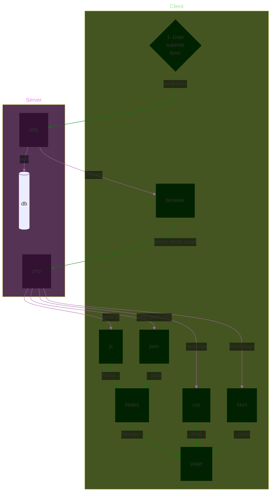

```mermaid
%%{init: {'themeVariables': { 'edgeLabelBackground': 'transparent'}}}%%
flowchart TB
    classDef default stroke: none;
    classDef return fill:green;
    classDef pad padding-left:8px, padding-right:8px;
    classDef db line-height:3, padding:11px, padding-bottom:0px, stroke:#535;
    classDef green fill:#020;
    classDef violet fill:#313;

    subgraph cpad[Client]
    subgraph client[ ]
        f1{1. User<br>submits<br>form}:::green
        b1[browser]:::green
        h1[html]:::green
        c1[css]:::green
        j1[js]:::green
        json:::green
        n1[Notes]:::green
        page:::green
    end
    end

    style cpad color: lightgreen, width:0;
    style client fill:#452;

    subgraph spad[Server]
    subgraph server[ ]
        php1[php]:::violet
        php2[php]:::violet
        db[(db)]:::db
    end
    end

    style spad color: violet, width:0;
    style server fill:#535;

    class b1,c1,j1,json,h1,n1,page,php1,php2 pad

    f1 --send form--> php1
    php1 --add--> db
    php1 --redirect--> b1
    b1 --query whole page--> php2
    php2 --send page--> h1
    php2 --send css--> c1
    php2 --send js--> j1
    php2 --send json (xhr)--> json
    j1 --Parse...--> n1
    json --...data--> n1
    n1 --Render...--> page
    c1 --...final...--> page
    h1 --...page--> page

    linkStyle 0,3,8,9,10,11,12 stroke:green;
    linkStyle 1,2,4,5,6,7 stroke:#a6a
```