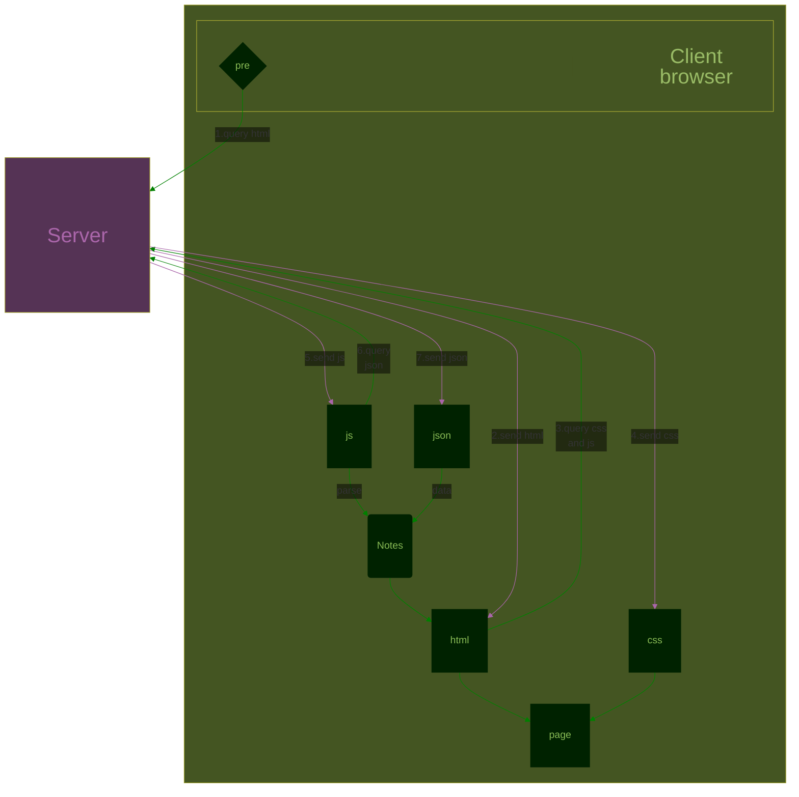

```mermaid
%%{init: {'themeVariables': { 'edgeLabelBackground': 'transparent'}}}%%
flowchart TB
    classDef default stroke: none, line-height:1.5;
    classDef pad padding-left:8px, padding-right:8px;
    classDef greenFill fill:#020;
    classDef greenTxt color:#8b5;
    classDef php padding:10px, fill:#535, font-size: 33px, color:#a6a;
    classDef ots font-size:33px, fill:#452, color: #9b6, line-height: 1;
    classDef dum fill:#452;

    subgraph cpad[ ]
    subgraph client[ ]
        subgraph subo[ ]
            pre{pre}:::greenFill
            dum1[ ]:::dum
            dum2[ ]:::dum
            dum3[ ]:::dum
            dum4[ ]:::dum
            dum5[ ]:::dum
            ots[Client<br>browser]:::ots
        end
        h1[html]:::greenFill
        j1[js]:::greenFill
        c1[css]:::greenFill
        json[json]:::greenFill
        n1(Notes):::greenFill
        p1[page]:::greenFill
    end
    end

    style cpad color: green, width:0, font-size: 22px;
    style client fill:#452;
    style subo fill:#452

    subgraph srv[ ]
        php1[Server]:::php
    end

    style srv fill:#535;

    class h1,j1,c1,json,n1,p1 pad
    class pre,h1,p1,c1,j1,json,n1 greenTxt

    pre --1.query html --> srv
    srv --2.send html --> h1
    h1 --3.query css<br>and js--> srv
    srv --4.send css --> c1
    srv --5.send js ---> j1
    j1 --6.query<br>json--> srv
    srv --7.send json --> json
    j1 --parse--> n1
    json --data--> n1
    h1 --> p1
    c1 --> p1
    n1 --> h1
    
    linkStyle 0,2,5,7,8,9,10,11 stroke:green;
    linkStyle 1,3,4,6 stroke:#a6a
```