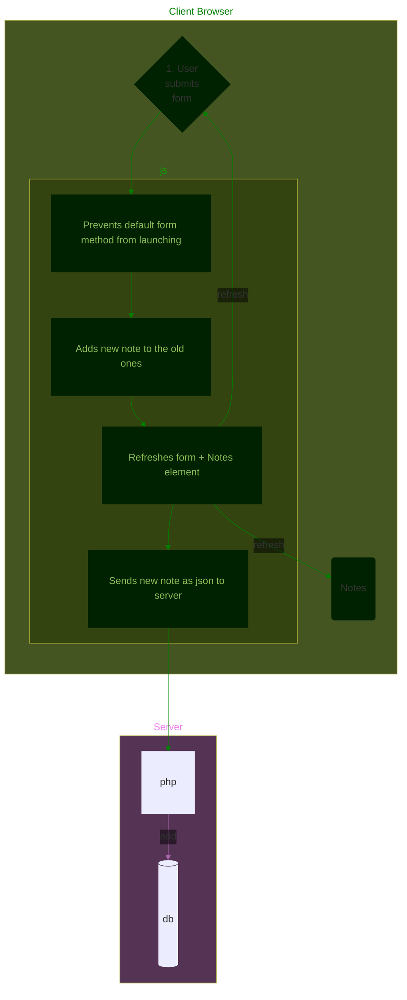

```mermaid
%%{init: {'themeVariables': { 'edgeLabelBackground': 'transparent'}}}%%
flowchart TB
    classDef default stroke: none;
    classDef pad padding-left:8px, padding-right:8px;
    classDef db line-height:3, padding:11px, padding-bottom:0px, stroke:#535;
    classDef greenFill fill:#020;
    classDef greenTxt color:#8b5;

    subgraph cpad[Client Browser]
    subgraph client[ ]
        f1{1. User<br>submits<br>form}:::greenFill
        subgraph jpad[js]
        subgraph js[ ]
            j1[Prevents default form method from launching]:::greenFill
            j2[Adds new note to the old ones]:::greenFill
            j3[Refreshes form + Notes element]:::greenFill
            j4[Sends new note as json to server]:::greenFill
            
        end
        end
        n1(Notes):::greenFill
    end
    end

    style cpad color: green, width:0;
    style jpad color: #0a0, width:0;
    style client fill:#452;
    style js fill:#341

    subgraph spad[Server]
    subgraph server[ ]
        php1[php]:::violet
        db[(db)]:::db
    end
    end

    style spad color: violet, width:0;
    style server fill:#535;

    class j1,j2,j3,j4,n1,php1 pad
    class j1,j2,j3,j4 greenTxt

    f1 --> j1
    j1 --> j2
    j2 --> j3
    j3 --> j4
    j3 --refresh--> f1
    j3 --refresh--> n1
    j4 --> php1
    php1 --add--> db
    
    linkStyle 0,1,2,3,4,5,6 stroke:green;
    linkStyle 7 stroke:#a6a
```